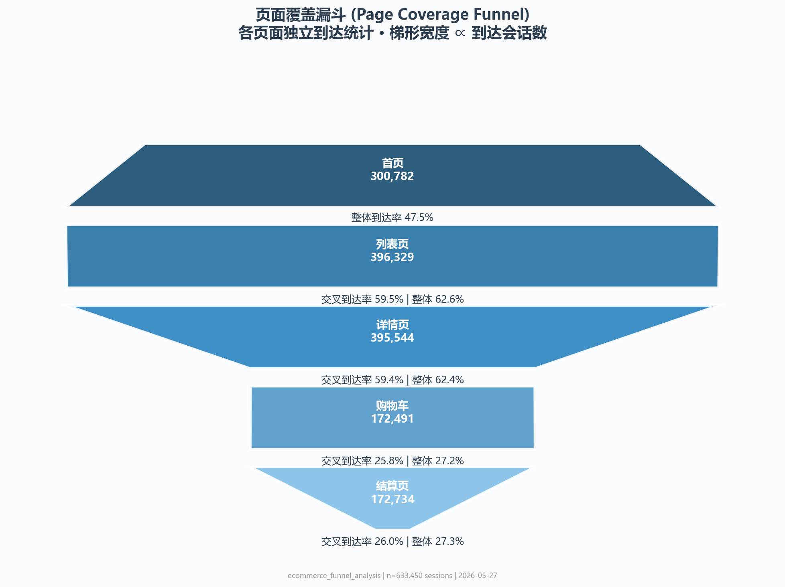
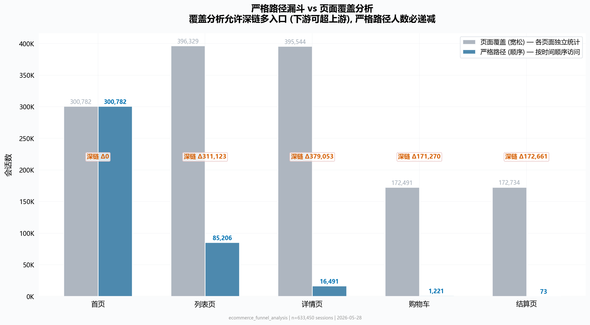
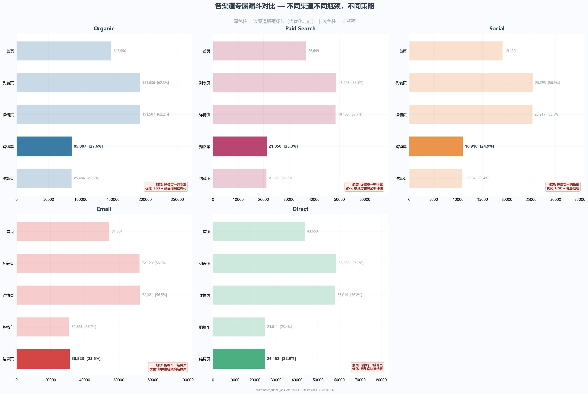
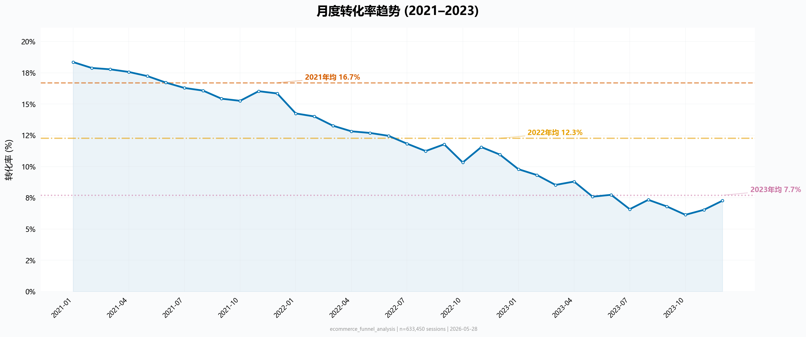
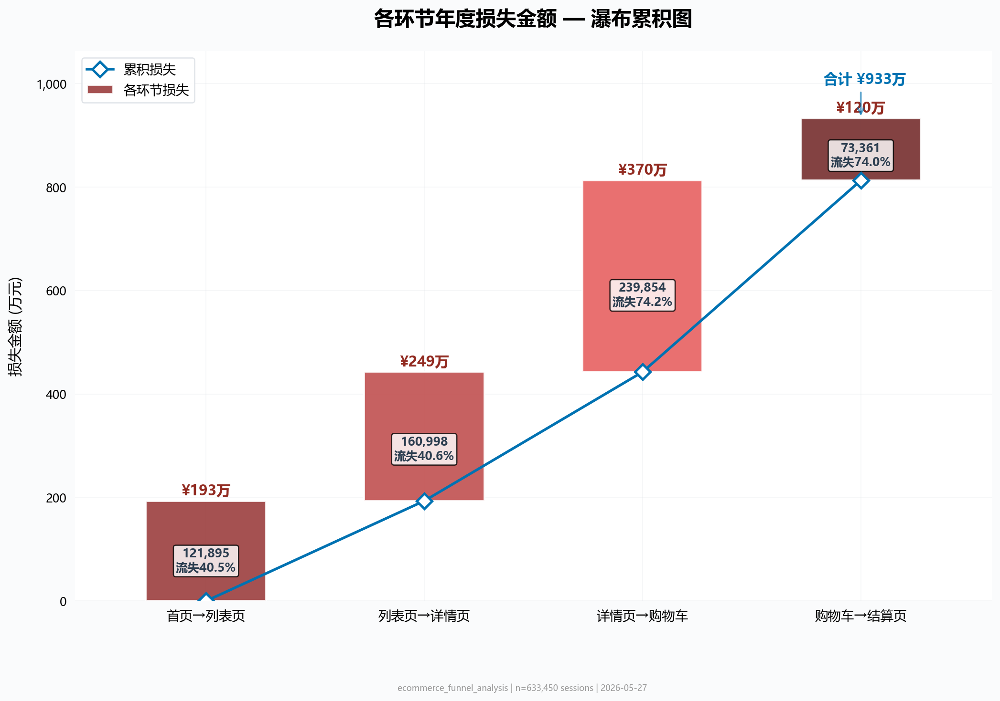
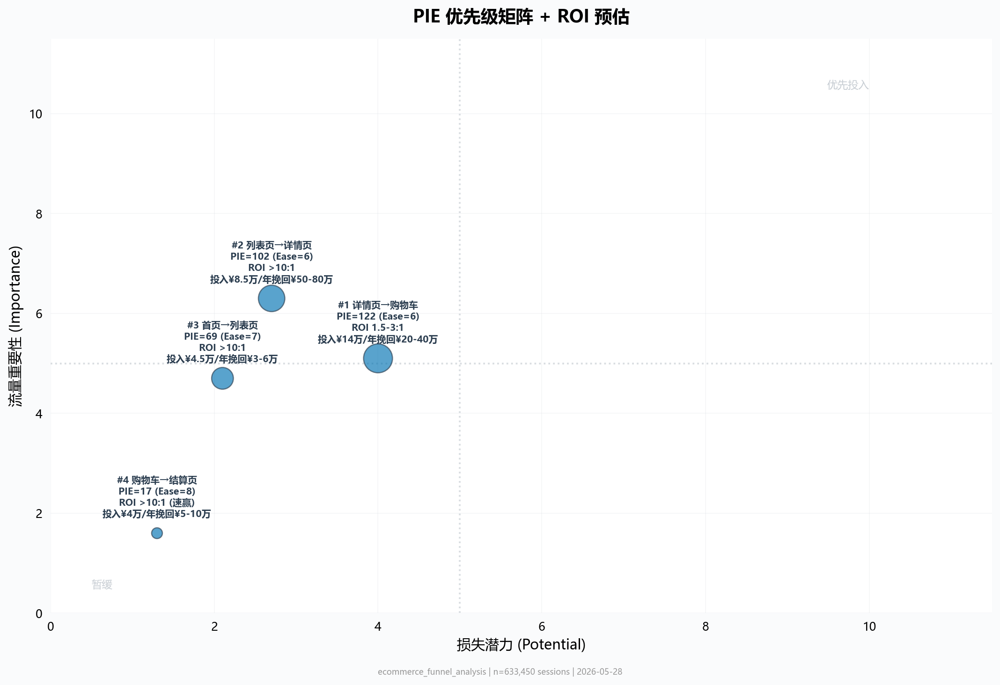
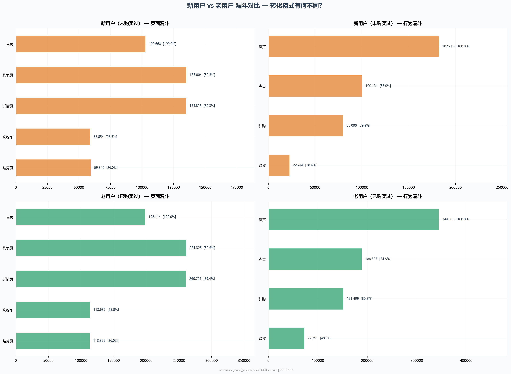
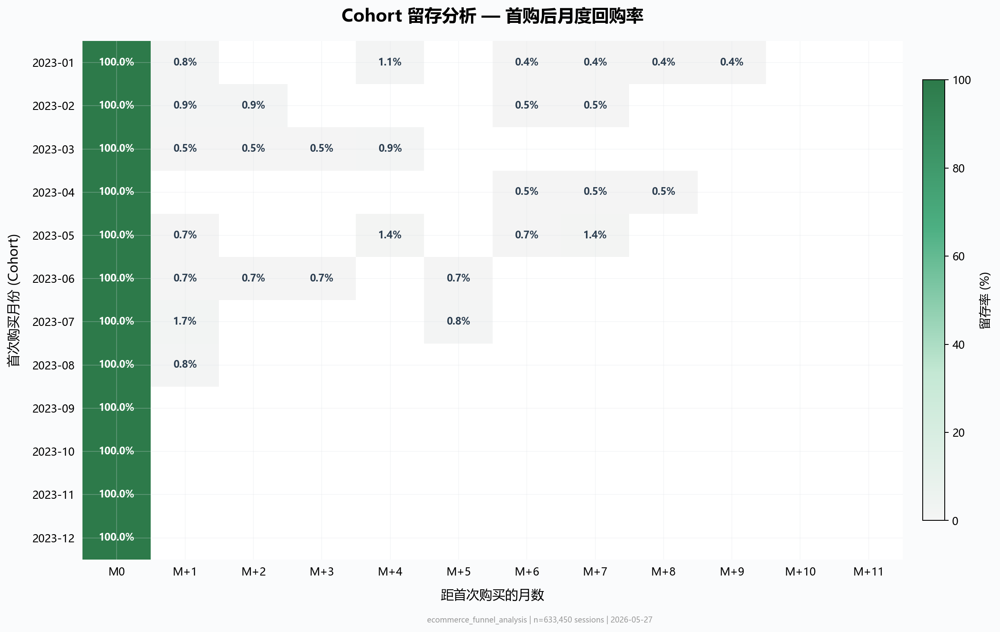
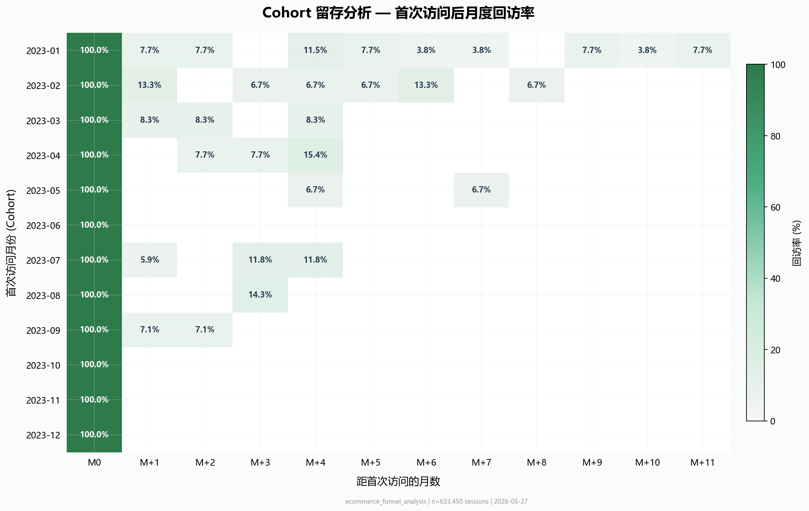

# E-Commerce Funnel Analysis & CRO

> 基于 220 万条用户行为数据的端到端转化率优化分析。这不是一个"跑一遍代码出结果"的脚本集合，而是一个从业务问题出发、经过多轮 AI 协作迭代、最终产出可执行策略的完整数据分析项目。

[](https://www.python.org/)
[](https://www.mysql.com/)
[](https://scipy.org/)
[](https://matplotlib.org/)
[](https://plotly.com/)
[](https://pandas.pydata.org/)
[](https://powerbi.microsoft.com/)

---

## 1. 项目背景

### 为什么做这个项目？

作为一名数据分析师，我需要一份能展示完整能力链的作品集——不是单点的"我会写 SQL"或"我会画图"，而是从业务问题出发、经过数据清洗和分析、最终产出可执行策略的端到端流程。

电商转化率优化（CRO）是最适合的题材：业务逻辑直观、分析方法论丰富、从数据到策略的链路完整。我选择了 Kaggle 上的一套模拟电商数据集（220 万行），模拟了一个中大型电商平台 2021-2023 年的用户行为。

### 数据规模

| 表 | 行数 | 字段 | 说明 |
| :--- | ---: | ---: | :--- |
| `events.csv` | 2,000,000 | 12 | 用户行为事件流（浏览/点击/加购/购买） |
| `transactions.csv` | 103,127 | 9 | 交易订单（含退款状态） |
| `customers.csv` | 100,000 | 7 | 用户画像（忠诚度等级/获客渠道） |
| `products.csv` | 2,000 | 6 | 商品信息（品类/价格） |
| `campaigns.csv` | 50 | 7 | 广告活动（渠道/预算） |

> 数据为算法生成的模拟数据，非真实用户日志。所有分析结论用于方法论演示。

---

## 2. 解决了什么问题？

### 业务层面的核心问题

一个电商平台的运营团队通常面临三个层次的问题：

| 层次 | 问题 | 如果没有分析 |
| :--- | :--- | :--- |
| **发生了什么？** | 转化率是多少？哪个环节流失最严重？ | 团队凭直觉优化，可能花三个月改首页，但瓶颈在详情页 |
| **为什么会发生？** | 流失是渠道问题还是页面体验问题？不同用户群是否有差异？ | 只能猜测，A/B 测试的方向全凭运气 |
| **应该怎么做？** | 先改哪里？要花多少钱？改了能回本吗？ | 资源分散，改了一堆但转化率没动 |

### 本项目回答的具体问题

1. **漏斗瓶颈定位**：在五个页面环节中，哪个是转化的最大断裂点？
2. **真实用户路径刻画**：用户真的是按首页→列表页→详情页→购物车→结算页走的吗？还是跳过中间页？
3. **多维度下钻**：不同渠道、设备、国家的用户，瓶颈是否相同？
4. **损失量化**：每个环节的流失意味着多少金额损失？
5. **策略优先级**：在有限的研发资源下，先改哪个环节 ROI 最高？
6. **趋势诊断**：转化率三年的持续下滑，是流量质量下降还是产品体验恶化？

---

## 3. 如何解决的？

### 整体思路：六阶段分析闭环

```
数据探查 → 数据清洗 → 漏斗建模 → 多维诊断 → 流失根因 → 损失量化 & 策略闭环
```

### 3.1 数据探查与清洗

五表加载 → `traffic_source` 字段标准化 → 会话时长异常值过滤（1s - 2h）→ 去重 → 漏斗宽表构建。

最终产出 `funnel_wide.csv`：633,450 行会话级数据，每行包含该会话是否到达了五个页面、是否触发了四种行为事件、所属渠道/设备/国家等维度字段。

### 3.2 漏斗建模：为什么用"双漏斗"？

第一个关键方法论决策。传统做法是按 Home→PLP→PDP→Cart→Checkout 的严格顺序统计各步转化率。但跑完数据后发现：**仅 0.02%（73/300,782）的用户按严格顺序走完全程**。95.8% 的 PDP 流量来自深链（广告直达、搜索直达），根本不过首页。

这意味着：**单一漏斗模型会丢弃 95% 的用户行为信息。**

解决方案：同时跑两套模型。

| 模型 | 统计方式 | 回答的问题 |
| :--- | :--- | :--- |
| **页面覆盖分析**（宽松漏斗） | 各页面独立统计到达会话数，计算相邻页面交叉到达率 | 每个页面的触达能力如何？哪个环节覆盖下降最陡？ |
| **严格路径漏斗** | 必须按时间顺序 Home→PLP→PDP→Cart→Checkout | 理想路径的留存率是多少？是否存在"跳跃式"浏览？ |

两个模型对照阅读：覆盖分析告诉你**问题在哪**（详情页→购物车），严格漏斗告诉你**用户的真实路径长什么样**（绝大多数人不走标准路径）。

### 3.3 多维诊断：不只看出"整体"，更看出"差异"

在漏斗建模的基础上，按 6 个维度下钻：

- 渠道（Organic / Paid Search / Social / Email / Direct）
- 设备（Desktop / Mobile / Tablet）
- 国家 × 转化率
- 品类漏斗
- 用户忠诚度等级 × 转化
- 获客渠道 × 长期转化

每个维度都跑独立的漏斗分析，找差异最大的维度——差异越大，优化空间越大。

### 3.4 流失根因：统计检验，不是肉眼看

多维度下钻分析有一个陷阱：**大样本下几乎所有差异都"显著"**（63 万个会话，p 值动不动就 <0.001）。

用三种方法配合使用，避免误判：

| 方法 | 做什么 | 在本项目中的应用 |
| :--- | :--- | :--- |
| **独立样本 t 检验** | 检验两组的均值差异 | 流失用户 vs 转化用户的事件数、会话时长等行为指标差异 |
| **Cohen's d** | 量化效应大小 | 判断差异"实际上大不大"（d=0.2 小，0.5 中，0.8 大） |
| **Bonferroni 校正** | 控制多重比较错误率 | 同时对多个维度跑检验时，提高显著性阈值 |

### 3.5 损失量化与策略闭环

损失公式：**流失会话数 × 预期转化率 × 客单价 ¥90.36**

但这只是第一步。真正的策略闭环需要回答"然后呢？"——用 PIE（Potential × Importance × Ease）矩阵给每个瓶颈打分，按优先级排 P0/P1/P2，并估算每个优化方向的一次性投入和年化回报。

完整的 CRO 策略文档见 [operations/cro_strategy.md](operations/cro_strategy.md)，涵盖实施人天、成本估算和 ROI 预估。

---

## 4. 核心可视化结果

### 页面漏斗 — 一图定位瓶颈

详情页→购物车交叉到达率仅 25.81%。74% 的用户在详情页看完后没有把商品加入购物车。这是整个漏斗的断裂带。



### 双漏斗对照 — 为什么单一模型不够用

左：宽松覆盖，每个页面独立统计到达数；右：严格路径，必须按顺序经过。两者差异巨大——仅 4.2% 的 PDP 流量来自标准路径。



### 渠道漏斗对比 — 不同渠道需要不同策略

三个渠道（Social、Paid Search、Organic）的核心瓶颈在详情页→购物车，但 Email 和 Direct 渠道的瓶颈在购物车→结算页——邮件链接直达购物车后，结算体验成为断裂带。渠道不同，优化重点也不同。



### 月度转化率趋势 — 三年持续下滑

从 2021 年的 ~17% 降至 2023 年的 ~8%，降幅 53%。这不是月度波动——是结构性趋势。



### 流失瀑布 — 各环节损失的绝对值

每个环节导致的流失会话数和预估金额损失，用来判断"哪个环节损失最大"。



### PIE 优先级矩阵 — 告诉你先做什么

PIE = Potential × Importance × Ease（WiderFunnel 方法论，10 分制）。详情页→购物车得分最高（P=4.0, I=5.1, E=6.0 → 122 分），落在高影响+高易实施象限，是 P0 中的 P0。购物车→结算页虽然 Ease 最高（8.0），但 Potential 和 Importance 太低，优先级反而最低。



### 新老用户漏斗对比 — 两类用户的行为差异

新老用户的页面漏斗几乎一致（瓶颈都在详情页→购物车，约 25.8%），但行为漏斗差异巨大——老用户的浏览→购买转化率（21.12%）是新用户（12.48%）的 1.7 倍。差异不在于"走什么路径"，而在于每到一个页面后，老用户更愿意做点击、加购这类高意图动作。对新用户的优化方向不是改页面结构，而是引导互动深度。



### 同期群留存热力图 — 两个视角

**回购留存**：每行是一个月首次购买的用户同期群，每列是第 N 个月的回购率。回答的是"用户买了第一次之后，多久会回来买第二次？"



**访问留存**：每行是一个月首次访问的用户同期群，每列是第 N 个月的回访率。回购留存只覆盖购买用户（~15%），访问留存覆盖全部用户——回答的是"用户来了一次之后，还会不会再来？"两张图对照阅读：回购留存高但访问留存低的同期群，说明"逛的人多但买的人少"，需要从转化入手而非流量。



---

## 5. 遇到的问题与应对

### 问题 1：模拟数据的转化率差异太小

**现象**：各渠道、各国家、各品类的转化率差异只有 1-2 个百分点。真实电商中，渠道间的转化率差 3-5 倍是常态。

**应对**：两个决定。(1) 继续用这个数据——数据分析师的日常就是面对不完美的数据；(2) 所有结论标注"基于模拟数据"，在 README、文档、图表脚注中反复说明局限。面试中展示"知道自己不知道什么"比假装数据完美更成熟。

### 问题 2：严格漏斗 vs 宽松漏斗的"倒挂"困惑

**现象**：宽松漏斗中，购物车到达数（172,491）少于结算页到达数（172,734），出现"下游超过上游"的反直觉结果。

**应对**：宽松漏斗统计的是"是否到达过该页面"，不是"按顺序经过"。大量用户通过深链直达结算页（如邮件一键结账），因此结算页的独立到达数可以超过购物车。这不是数据错误，是业务现实。将两个模型明确命名（"覆盖分析" vs "严格路径"），并在图表标题中标注统计口径，避免混淆。

### 问题 3：大样本下的统计显著性问题

**现象**：63 万个会话，任何细小的差异（如 0.5pp 的转化率差）跑 t 检验都能得到 p < 0.001。

**应对**：t 检验 + Cohen's d + Bonferroni 校正三件套配合使用。t 检验确认差异是否大于随机波动，Cohen's d 量化差异的实际大小（多数 d 在 0.1-0.3 之间，属小效应），Bonferroni 保证多重比较不产生假阳性。面试中这展示了"知道自己用的方法有什么局限"的意识。

### 问题 4："交叉到达率"和"转化率"的命名陷阱

**现象**：最初在文档中把宽松漏斗的指标叫"转化率"。

**应对**：改名。宽松漏斗中"同时到达 A 和 B 的会话 / 到达 A 的会话"描述的是重叠关系，不是因果顺序关系。叫"转化率"会误导读者以为用户在按顺序走。改名为"交叉到达率"——一个命名差异背后是对指标口径的严谨态度。

---

## 6. 最终成果

### 六阶段完整产出

| 阶段 | 产出 |
| :--- | :--- |
| 数据探查 | 五表质量报告 + 关联完整性校验 |
| 数据清洗 | `funnel_wide.csv`（633,450 行 × 38 列） |
| 漏斗建模 | 页面漏斗 ×2 + 行为漏斗 + 5 渠道漏斗 + 品类漏斗 |
| 多维诊断 | 渠道/设备/国家/品类/忠诚度/获客 × 时段/趋势/交叉 |
| 流失根因 | 统计显著性报告（含效应量 + 多重比较校正） |
| 策略闭环 | PIE 优先级排序 + 实施成本估算 + ROI 预估 + What-If 模拟 |

### 核心数字

| 指标 | 数值 |
| :--- | :--- |
| 分析会话数 | 633,450 |
| 整体会话转化率 | 15.08% |
| 最大瓶颈 | 详情页→购物车（交叉到达率 25.81%） |
| 年预估损失 | ¥9,328,840 |
| 三年转化率降幅 | 53%（16.97% → 7.98%） |
| P0 优化方向 | 详情页改版（预期 ROI 1.5-3:1） |

### 一句话

**发现了瓶颈、量化了损失、给出了优先级排序和 ROI 估算——数据→洞察→策略→度量，完整闭环。**

---

## 7. AI 协作方式：Claude Code + OpenClaw 的双引擎工作流

这个项目的另一个亮点是**与 AI 的深度协作方式**。不是"让 AI 帮我写代码"，而是建立了一套 AI 辅助的数据分析工作流。

### 协作架构

```
用户 (tian, 数据分析师)
  │
  ├─→ Claude Code (VS Code 插件)        ← 主力开发引擎
  │   - 脚手架搭建、代码实现、调试
  │   - 需求理解 & 方案设计
  │   - 图表优化 & 参数调整
  │   - Git 管理 & 文档编写
  │
  └─→ OpenClaw (FAFA, 工作区 Agent)    ← 自主分析 & 质量把关
      - 项目背景感知 (AGENTS.md, SOUL.md)
      - 跨会话记忆 (memory/ 每日笔记)
      - 主动发现数据问题 & 提出优化方向
      - 按"简历导向"标准审视每个结论
```

### Claude Code 的角色：主力开发引擎

项目的全部代码（Python、SQL、Power BI 配置）都是通过 Claude Code 在 VS Code 中完成的。协作模式不是"一行一行问 AI 怎么写"，而是：

1. **需求表达**：用自然语言描述分析目标（"我需要一个双漏斗模型，宽松统计和严格路径各一套"）
2. **代码生成**：Claude 生成完整的模块代码，包含类型提示、docstring、错误处理
3. **迭代优化**：运行 → 看结果 → 描述不满意的点 → Claude 修改 → 再运行
4. **多轮审查**：项目经历了多次内部 review（见 `docs/reviews/`），每次发现的问题都通过 Claude 修复

关键经验：**用 AI 做数据分析，难点不是"写代码"，而是"问对问题"。** 必须把模糊的业务需求（"帮我分析转化率"）拆解为精确的分析指令（"跑五个渠道各自的漏斗，对比哪个环节差异最大，用 Cohen's d 量化效应"）。

### OpenClaw (FAFA) 的角色：自主分析 Agent

OpenClaw 是一个面向数据分析场景的 AI 工作区框架。在本项目中的配置：

- **身份定义**（IDENTITY.md, SOUL.md）：FAFA，一个"犀利洞察 + 严谨专业"的数据分析助手，核心理念是"用数据说话，不是用感觉说话"
- **工作约定**（AGENTS.md）：定义了分析六阶段的执行规范、指标口径约定、行业基准、禁止事项（不编造数据、诚实标注模拟数据局限）
- **持久记忆**（memory/）：跨会话维护项目上下文，避免每次对话都从零开始
- **简历导向标准**：FAFA 被明确要求审视每个结论是否"够硬"——是否有统计检验支撑、是否有量化数字、是否有行业基准对标

关键经验：**给 AI 建立"人设"和"工作约定"，比裸写 prompt 有效得多。** FAFA 的人格（直接、严谨、简历导向）不是一句 system prompt，而是通过 SOUL.md + AGENTS.md + memory 三件套维持的稳定行为模式。

### 双引擎分工的实际案例

以"漏斗建模方法选型"为例：

1. 用户提出："帮我画个转化漏斗"
2. Claude Code 实现第一版：严格的 Home→PLP→PDP→Cart→Checkout 顺序漏斗
3. OpenClaw (FAFA) 在 review 中发现：**95.8% 的 PDP 流量在严格漏斗中丢失**，提出应加入宽松覆盖分析作为对照
4. 用户采纳，Claude Code 实现双漏斗模型
5. 后续 review 中，DeepSeek 和 MiniMax 的交叉验证确认了这个方向

### 多 AI 交叉验证

项目还引入了一个独特实践：用不同的 AI 模型独立 review 同一份分析结果，然后对比它们的意见。

`docs/reviews/` 目录下保存了完整的 review 记录：
- Claude (OpenClaw) 的自主分析意见
- DeepSeek 的独立 review
- MiniMax (Qwen) 的独立 review
- 三者的**consolidated review**——合并后的问题清单

这个做法的价值：不同 AI 关注的点不同（有的关注代码质量，有的关注统计方法，有的关注可视化），交叉验证能发现单一模型遗漏的问题。

### 项目中的 AI 使用统计

| 指标 | 数值 |
| :--- | :--- |
| 总 commit 数 | 20+ |
| Claude Code 参与的 commit | 全部（从脚手架到最终 README） |
| OpenClaw review 次数 | 3 轮完整审查 |
| 跨 AI 交叉验证 | 3 个模型（DeepSeek + MiniMax + Claude） |
| 从启动到完成 | 约 2 周（含多轮迭代和重构） |

### 这套工作流的可复制性

整套工作流的关键文件都在仓库中（AGENTS.md、SOUL.md、TOOLS.md、IDENTITY.md、memory/ 目录），其他数据分析师可以直接参考这套配置，建立自己的 AI 协作工作区。

---

## 项目结构

```
ecommerce_funnel_analysis/
├── data/                     # 原始数据 (未上传，需自行生成)
├── python/                   # 分析引擎 (6 个模块)
│   ├── config.py             # 全局配置 + CRO 行业基准 + 统计参数
│   ├── data_loader.py        # 五表加载 + 探查 + 质量报告
│   ├── data_cleaning.py      # 会话异常值清洗 + 漏斗宽表
│   ├── funnel_analysis.py    # 20+ 分析函数 (双漏斗/多维诊断/统计检验/损失量化)
│   ├── visualization.py      # 23 张图表 (matplotlib + plotly)
│   └── main.py               # 主入口 (支持 --skip-viz / --output)
├── sql/                      # 8 个独立 SQL 脚本 (MySQL 8.4)
├── powerbi/                  # Power BI PBIR 报表 (4 页交互式)
├── docs/                     # 分析文档 + 多 AI 交叉 review 记录
├── operations/               # CRO 策略详情 (含实施成本 + ROI 估算)
├── .openclaw/                # OpenClaw 工作区配置
├── output/charts/            # 23 张可视化图表
└── tests/                    # pytest 单元测试 + 集成测试
```

## 快速运行

```bash
pip install -r requirements.txt
python python/main.py
```

**运行环境**：Python 3.13+ | MySQL 8.4（仅 SQL 脚本需要）| 内存 ≥ 4GB | 运行时间约 3-4 分钟

**完整版分析文档**见 `docs/04-results.md`，**CRO 策略详情**见 `operations/cro_strategy.md`。

---

## 技能展示清单

| 能力维度 | 本项目体现 |
| :--- | :--- |
| **业务理解** | 将模糊的"提升转化率"拆解为可度量的漏斗环节和 PIE 优先级 |
| **数据清洗** | 会话时长异常值处理、traffic_source 标准化、多表关联去重 |
| **分析框架设计** | 六阶段闭环 + 双漏斗模型 + 20+ 维度下钻体系 |
| **统计学基础** | t 检验、Cohen's d、Bonferroni 校正、卡方检验——知其所以然 |
| **SQL 能力** | 8 个独立脚本，从建表到运营导出，含窗口函数和 CTE |
| **Python 工程** | 模块化设计、CLI 参数化、日志系统、单元测试 |
| **数据可视化** | matplotlib 静态图表 + plotly 交互式图表 + Power BI 报表 |
| **商业敏感度** | 损失金额量化、ROI 估算、P0/P1/P2 优先级排序 |
| **局限性意识** | 明确标注模拟数据、指标口径差异、不做虚假承诺 |
| **AI 协作能力** | Claude Code + OpenClaw 双引擎工作流，多 AI 交叉验证 |

---

## 许可证

MIT
